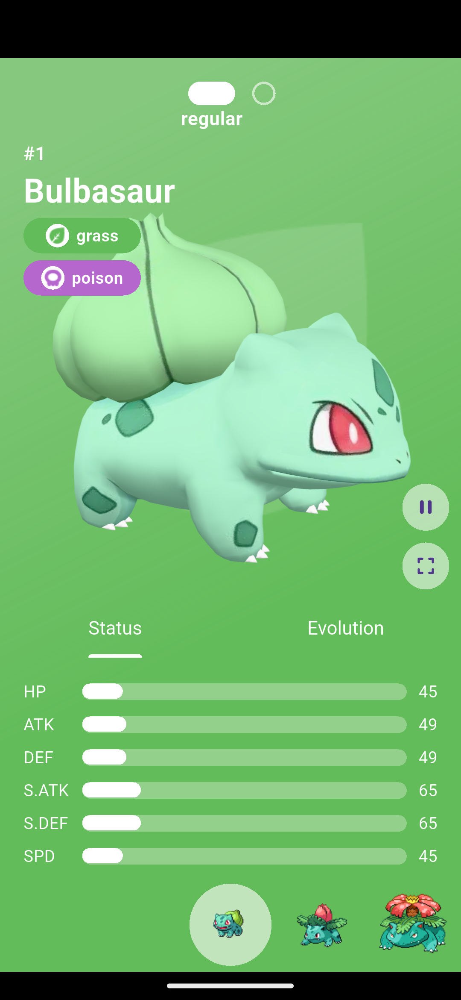
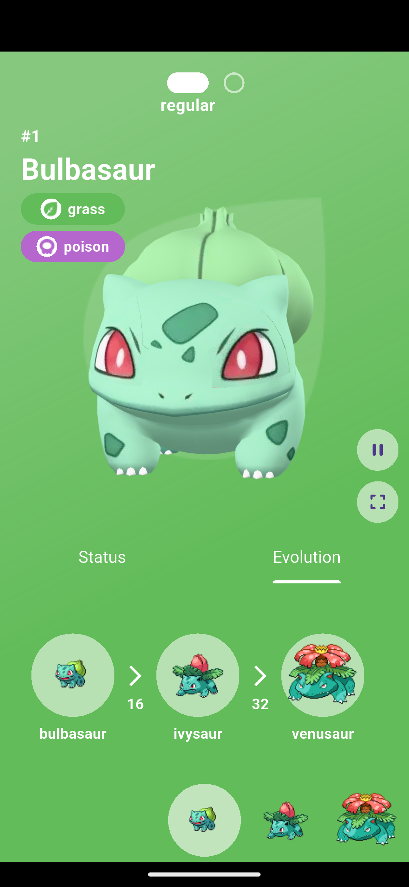

# Pokédex 3D

A Flutter-based 3D Pokédex application featuring interactive Pokémon models and detailed information.

## Features
- 🎮 3D Pokémon model viewer
- 📊 Detailed Pokémon information
- 🔄 Evolution chain tracking
- 🎨 Modern UI with smooth animations

## Status
🚧 **In Development** - Core features implemented, additional functionality being added
- 🔍 Pokémon search and filtering

## Demo

  
  
  
  

## Tech Stack
- Flutter
- Dart
- Provider pattern
- Repository pattern

## Platform Support
- ✅ Android
- 🚧 iOS (planned)
- 🚧 Web (planned)
- 🚧 Desktop (planned)