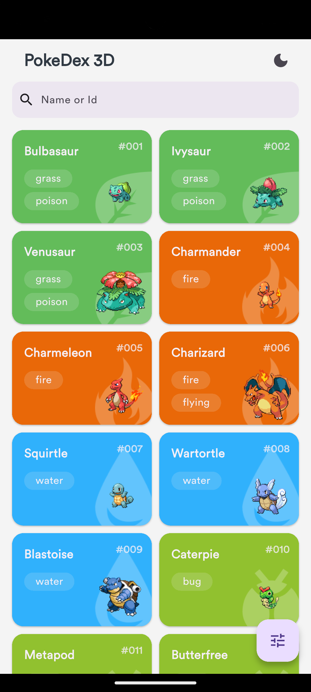

# Pokédex 3D

Pokédex 3D is a Flutter app for exploring Pokémon in 3D. Browse a grid of Pokémon cards, with options to search or filter by name, number, generation, or form (including Shiny and Mega). Selecting any Pokémon opens a detailed view featuring an interactive 3D model (with zoom and rotation), base stats, evolution chain, and different forms. Some models include simple animations to make them more lively.

## Features
- 🎮 3D Pokémon model viewer
- 📊 Pokémon information
- 🔄 Evolution chain info
- 🔍 Simple Pokémon search and filtering

## Demo
<p align="center">
  
  
  
  
</p>


## Getting Started

Make sure you have Flutter installed. See the [Flutter install guide](https://docs.flutter.dev/get-started/install).

### Clone the repository

```bash
git clone https://github.com/Eshwar-M17/flutter-pokedex-3d.git
cd flutter-pokedex-3d
```

### Install packages

```bash
flutter pub get
```

### (Optional) Use FVM for Flutter version management

To use the exact Flutter version specified in `.fvmrc`, you can set up FVM:

```bash
dart pub global activate fvm
fvm install
fvm use
fvm flutter pub get
```

### Run the app

```bash
flutter run
```

or with FVM:

```bash
fvm flutter run
```


## Tech Stack

### Language & Framework
- **Dart** - Programming language
- **Flutter** - Cross-platform UI framework

### Architecture Pattern
- **MVVM (Model-View-ViewModel)** - As recommended in the official Flutter documentation

### State Management
- **Riverpod** - Modern state management solution

### Data Storage & Caching
- **Hive** - Local storage for offline data persistence
- **flutter_cache_manager** - Asset and model caching

### Networking
- **http** - HTTP client for API requests

### Other Packages
- **model_viewer_plus** - 3D model rendering and viewing
- **webview_flutter** - WebView integration for 3D model display
- **cached_network_image** - Network image caching
- **freezed** - Code generation for immutable models
- **logger** - Logging utility
- **skeletonizer** - Loading skeleton animations
- **internet_connection_checker_plus** - Network connectivity monitoring
- **google_fonts** - Custom font support

## Architecture

This project uses the **MVVM (Model-View-ViewModel)** architecture, as recommended in the official Flutter documentation.

MVVM separates your app's business logic from the UI, making the codebase cleaner, easier to maintain, and more testable.

- **Model**: Handles data, logic, and state (from APIs, databases, or local storage like Hive).
- **View**: The UI—widgets that display models and listen to the ViewModel.
- **ViewModel**: Acts as a link between Model and View, exposes UI-ready data and commands, and handles state using Riverpod.

<p align="center">
  
</p>

## APIs & Credits

- **PokéAPI**: Main source for Pokémon stats, details, evolutions, and forms.
- **Sudhanshu-Ambastha/Pokemon-3D-api**: Provides Pokémon 3D model data and assets.
- **PokéAPI Proxy (freeCodeCamp)**: Used as an alternate proxy for PokéAPI requests.

## Platform Support
- ✅ Android
- 🚧 iOS (planned)
- 🚧 Web (planned)
- 🚧 Desktop (planned)